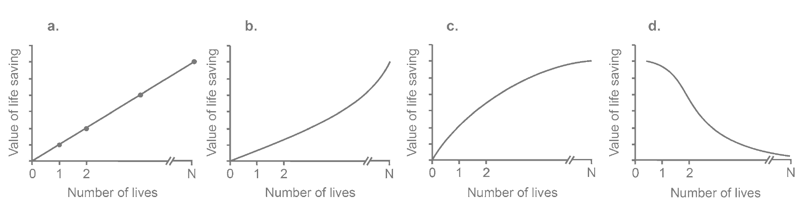
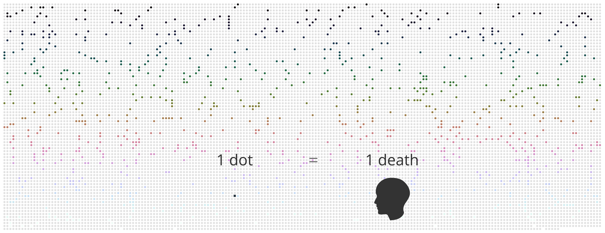
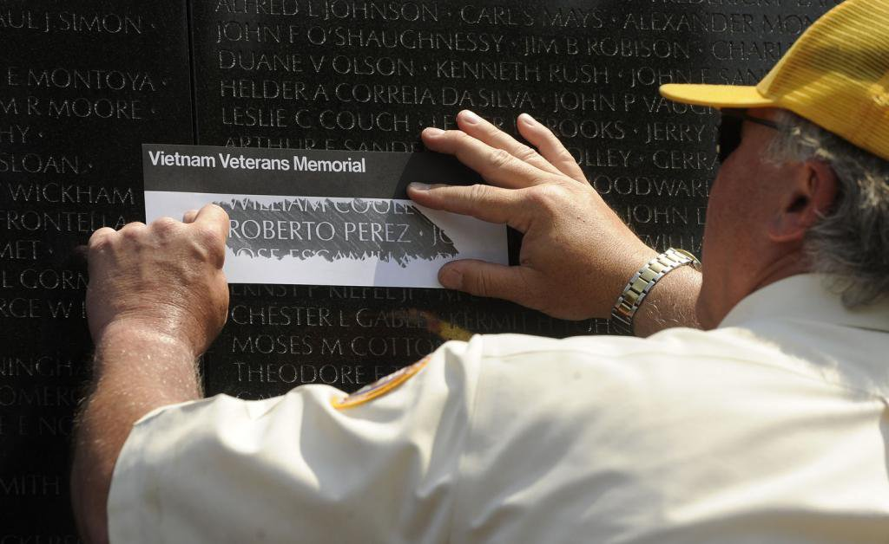

# Digital Data Rubbing
What if data visualization could be more than just numbers and efficiency, and actually engage human emotions like a personal story does?  

Special thanks to Alexandria Rengifo.  

## DATA

> Normative Models where (a) every life is of equal value and (b) large losses threaten group or societal descriptive models of (c) psychophysical numbing and (d) psychic numbing and the collapse of compassion, Image Credit: Paul Slovic and Daniel Västfjäll

 

To understand why traditional data visualization is not a great medium for connecting emotionally with sensitive topics, such as death rates in the midst of a pandemic, we need to understand how humans perceive data sets.  

In [The More Who Die, the Less We Care: Psychic Numbing and Genocide](https://www.researchgate.net/publication/283318445_The_More_Who_Die_the_Less_We_Care_Psychic_Numbing_and_Genocide), Paul Slovic and Daniel Västfjäll research how people respond to death rates. In the beginning, people’s level of care increases as death rates increase, however, after the death rate passes a certain threshold, a certain degree of numbness and insensitivity kicks in. In the end, the rising numbers fail to provoke the emotion or feeling necessary to motivate action.  

Building upon this insight, I sought to explore and find a way of visualizing large death data sets that could also engage people emotionally.  

 

## VISUALIZATION
On Sunday, May 24, 2020, on [the front page of The New York Times](https://www.nytimes.com/2020/05/26/learning/the-front-page.html), instead of a colorful mix of articles, photographs, and graphics, there was a long, solemn list of 100,000 people whose lives were lost due to the coronavirus pandemic. Readers reacted differently on whether this was a good decision or bad decision. Some appreciated that the front page paid respect to and honored the deceased. Other readers pointed out that it had poor legibility and possibly a negative effect on readers’ emotional state.  

From a data visualization perspective, the New York Times decision to publish these 100,000 names felt akin to some of the work I had been researching from Pentagram’s Georgia Lupi & team, creators of very inspiring [data visualizations during the COVID-19 pandemic](https://www.pentagram.com/work/covid-19-charts). Their intent was to “inject more nuance, context and humanity into the Governor’s various graphs and charts, without sacrificing the exactitude the public has come to depend on.” Their exploration led to the redesign of COVID-19 visualizations, which introduced an imprecise dot to metaphorically represent one individual death from the virus, creating a kind of visual memorial to those who have deceased.  

When comparing the work of Pentagram’s Georgia Lupi & team with the dot representation, to the traditional line charts and bar charts we see representing death rates, I realized that the latter is designed to be highly legible, self-explaining, and simple, while sacrificing a sense of context and individuality. The dot representation, on the other hand, doesn’t desensitize people to death data but rather pulls people’s attention in various ways. For example, the hand-drawn style of the dots and certain text seems evocative of human vulnerability. The desaturated hues of yellow are reminiscent of town lights at night, as if life lost is emitting light in all directions, and portraying it as such is a way of paying respect to each individual. The overall composition is inviting and makes you want to stop and decipher it’s meaning.

Ultimately, these learnings from the “one dot = one death” concept became a foundational component of my first prototypes of a data visualization that could sensitize large scale death data sets.  
 

## RITUALS

> Photo credit: Vietnam Veterans Memorial Fund
 

The next step was to imagine how data visualization could not only be emotionally engaging, but also, be transformed into a personal, reflective experience. To do so, I researched and analyzed different mourning and memorialization rituals in the physical world. There is a palette of rituals and symbolic gestures around death that people have done for many years. A moment of silence, serving flowers, igniting candles, and so on. What emerged to be important though was to find rituals that were both private and public in experience, in that people have a space to perform an action individually, but this action is part of or related to a larger public context that pertains to something like reflection and mourning in the time of COVID-19.  

Among all rituals I found, I was particularly attracted to the name rubbing, the beautiful moment at the Vietnam Veterans Memorial Wall designed by American architect Maya Lin. Name rubbing, something that was invented by visitors, rather than being planned by the architect, attaches significance to time and action. People who want to take a “piece of the wall” back with them, to their homes, or perhaps who weren’t able to visit in the first place but still want to make a connection, get someone to rub the name of their loved ones using paper and pencil. I found this to be a powerful interaction in that it creates a private moment in front of a large public memorial wall.  

From a data visualization perspective, rubbing is a very interesting interaction because it can both minimize the density of information and increase the density of information. For example, when someone performs a name rubbing at the Vietnam Memorial Wall, they lose part of the shape of each alphabet while they are adding a new texture and color found from the paper and pencil.  

Inspired, I wondered whether there could be a digital version of this name rubbing experience. I analyzed it to see whether it could be used to emotionally engage, in a personal, reflective, way, with COVID-19 death data. I believed that if successful, it could be a mechanism for creating digital spaces for private experiences within public experiences.  
 

## USER EXPERIENCE
At the synthesis of my research on dot representation and the name rubbing ritual came the concept and development for Digital Data Rubbing. In its simplest essence, it is a [d3 data visualization](https://observablehq.com/@kieich/covid-19-canvas-one-death-one-pixel) on the Observable platform that allows people to interact with COVID-19 death toll data. However, in interaction and form, it hopes to invite people to engage and reflect upon death in a new way.  

When you first land on the Observable page, there is a long, white canvas, below the title that creates a sense of possibility. The page will remain blank until the visitor uses their cursor to click and drag across the blank page, as if they were rubbing a pencil on an actual blank piece of paper. After a few moments, a mosaic of color will start to appear and become more and more saturated as the visitor continues the digital rubbing motion. Once saturated enough, the visitor will notice that certain Country and Date text will appear in response to where the cursor is located on the page. For example, it might say “China 2020-01-22”, “France 2020-12-31”, “Russia 2021-01-04”. It becomes a moving meditation of sorts, that intrigues visitors to read the text and influence the saturation and movement of the colors. Once the visitor stops the dragging rubbing motion on the canvas, the colors will slowly fade away until the canvas turns white again.  

On the back-end, what is happening is that the canvas pixels are connected to COVID-19 death data from 191 countries. One pixel on the canvas equates to one death from one country on a given date. As the cursor “rubs” over a pixel, color is added to that pixel, and simultaneously, the logic is such that since that pixel is connected to a certain country, the rubbing motion will also activate and color in all the other pixels connected to that country. For example, if we rub over one death that took place on Feb 13 in China, all deaths in China will be colored. And so, the more a visitor rubs deaths from different countries, the more saturated the hues of color on the entire canvas will look. Once the color is dense enough, a visitor can see the blocks of small text appear that give information about the location and date. There needs to be patience in order to read all of the details. It’s barely legible, just like the rubbing of text or beach sand text. This is part of the design decision to not make this about efficiency, but rather about emotional engagement.  

Furthermore, the Digital Data Rubbing canvas is completely dynamic, meaning it responds to the growing number of death rates. For example, on January 6, 2021, the data source reported a total of 1,872,088 deaths, which means there were 1,872,088 pixels on the canvas that could be colored in through the rubbing motion. Today, that number is inevitably higher, which means the number of pixels that can be activated on the canvas is larger too.  
 

## SACRED INTERACTIONS
Digital Data Rubbing also incorporates specific user interactions to heighten the sense of sacredness that mourning is connected to across the world.  

In my hometown, for example, the location of cemeteries are very far from residential areas. Remoteness makes the ritual special and significant, and tranquilness allows people to forget about everyday concerns.  

In order to instill this sense of remoteness and sacredness digitally, I built a website for Digital Data Rubbing that includes special interactions. Specifically, when visitors enter the page, it encourages them to change the browser to full-screen mode. That way, they’re no longer disturbed by lots of tabs on their browser. The canvas background is also purposely white in order to minimize noise and invite tranquilness.  

As a next step, I am exploring different user interactions related to sound and color. Cemeteries located in mountains are full of natural sounds such as birds chirping, bugs singing, and leaves rustling. Those sounds make the space more sacred, and can be incorporated digitally. The significance of color is highly influenced and dependent on what region or culture someone is from. Digital Data Rubbing could evolve to have customizable color palettes based on the visitor’s cultural backgrounds and preferences.  
